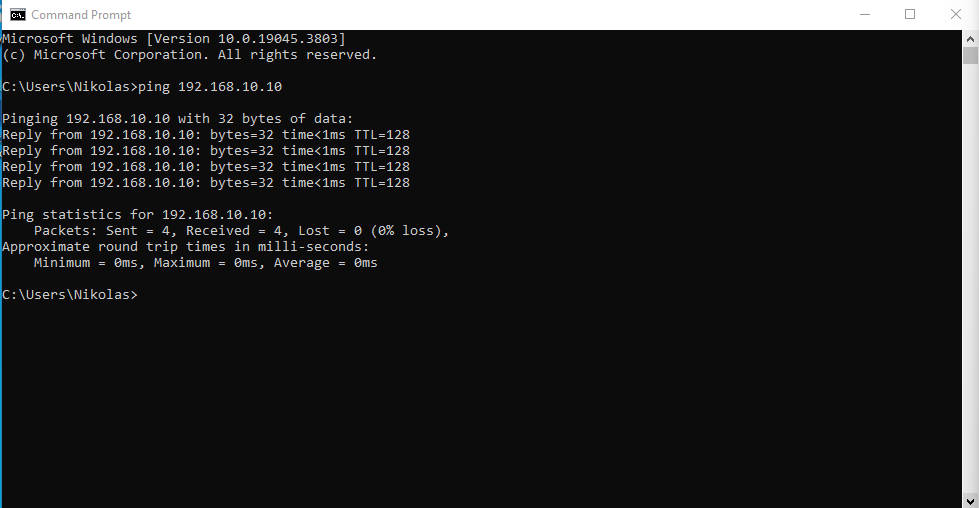
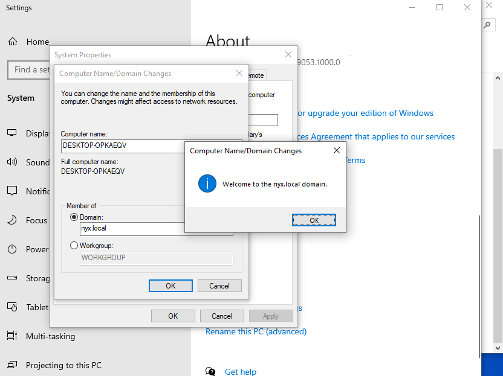

### Active Directory Project

## Technologies
- VirtualBox
- Windows Server 2022
- Active Directory
- Windows10 Pro

## Progress Log

# Phase1 -- setting up VirtualBox
- downloaded Windows Server 22 and Win10 .iso file
- Virtualization enabled UEFI
- created Admin Cred, Update the system
- changed Virtual Machines Network to Internal Network

# Phase2 -- Configure Windows Server

- installed Active Directory Domain Services
- Promote machine to be a Domain Contoller
- configured a static IPv4 for the domain to [192.168.10.10]
- added multiple users to ActiveDirectory

# Phase3 -- Configure Win10 
- installed Win10 Pro 
- configurated static IPv4 and DNS server to match Windows Server
- pinged server to check communication

- Successfully joined the Domain and logged in with random user creds [kim@nyx.local]

