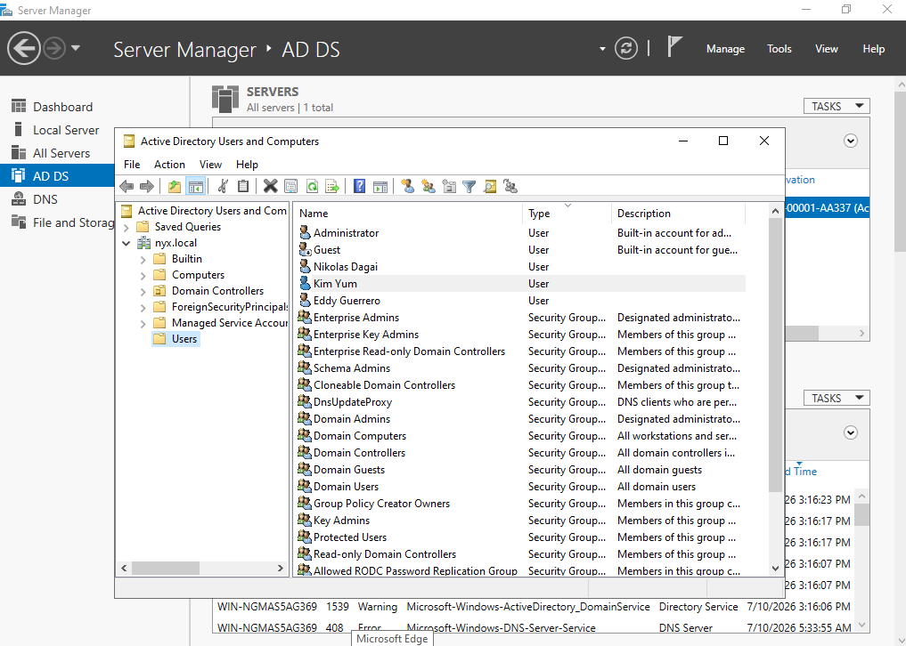
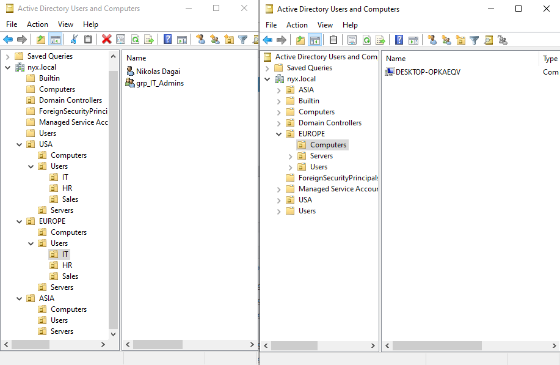
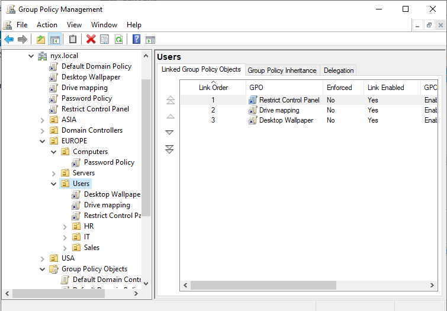
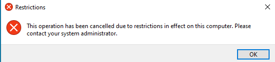
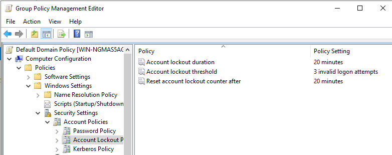
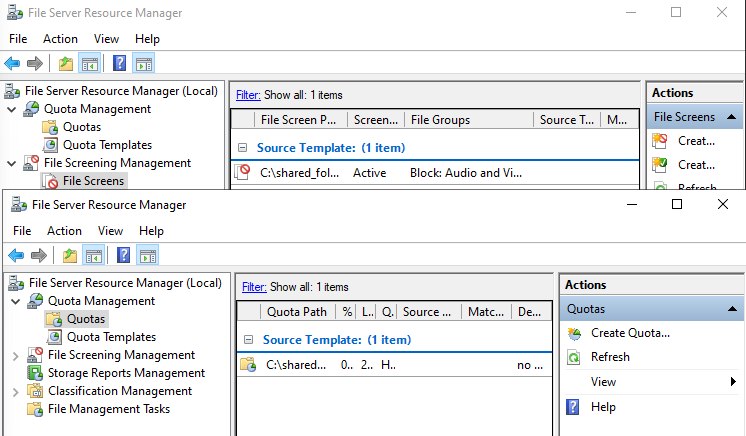
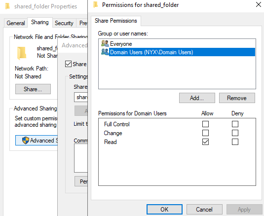
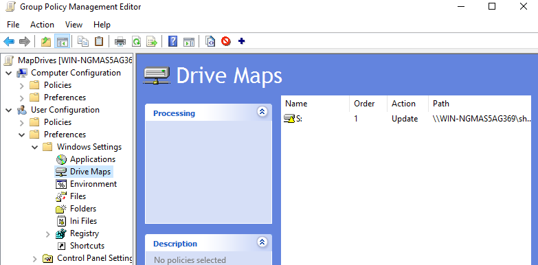

# Active Directory Project

## Overview
**Simulated enterprise Windows environment built in VirtualBox
to develop hands-on Active Directory and Group Policy skills**

## Technologies
- VirtualBox
- Windows Server 2022
- Active Directory
- Windows10 Pro
- Group Policy Management Console

## Environment setup

### Phase1 -- Hypervisor set up
- downloaded Windows Server 22 and Win10 .iso file
- Virtualization enabled UEFI
- created Admin Credentials && update the system
- changed Virtual Machines Network to Internal Network

### Phase2 -- Domain Controller setup
- installed Active Directory Domain Services
- Promote machine to be a Domain Controller
- configured a static IPv4 [192.168.10.10]

### Phase3 -- Client machine setup
- installed Win10 Pro 
- configured static IPv4 and DNS server to match Windows Server
- pinged server to check communication
- Successfully joined the Domain and logged in with random user creds [kim@nyx.local]

## Scenario1 -- create OUs structure & group policy
- created, designed a multi-region Active Directory
- moved my Win10 VM to the environment
- segregaded users, workstations and security groups
- set up a password policies to enforce security
- control panel poliies
- account lockout policy

## Scenario 2 -- File services, Permissions & Network drive mapping
- create a shared folder with permissons
- set NTFS and Shared Permissions to allow domain users access
- login as domain user and share using mapping and network types
- configure a GPO to automatically map Network drives for users
- update the GPO on the client machine
- install/configure File Server Resource Manager to create Quota template to manage file storage

